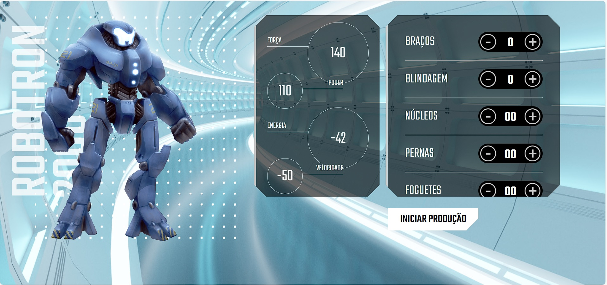

# Projeto Robotron-2000

<h3>Projeto desenvolvido na formação frontend da Alura, a qual utilizamos javascript para ter acesso a àrvore de elementos DOM do HTML para adicionamos atributos no nosso robotron.</h3>

## Linguagens utilizadas no projeto

<h3>Acesso ao projeto no link abaixo:</h3>
<a href="https://alura-robotron-2000-iota.vercel.app/">Acesso ao Projeto Online</a>
